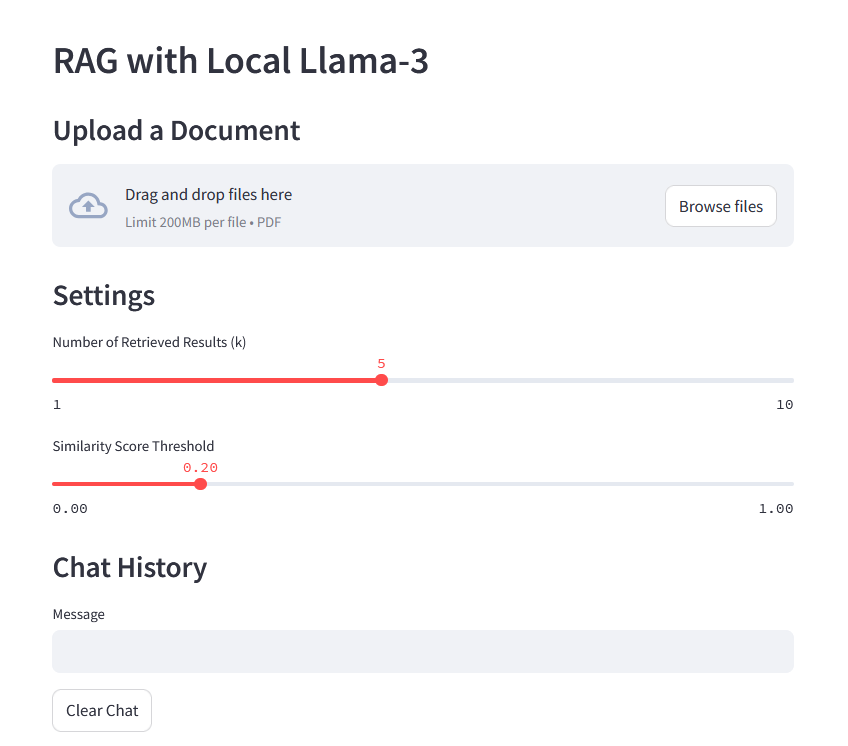

# LLM-RAG-Lora

本项目基于 Meta-Llama-3.1-8B-Instruct 进行RAG和Lora微调。

## Clone the Repository

```
git clone https://github.com/Hami-8/LLM-RAG-Lora.git
cd LLM-RAG-Lora
```

## Enviroment

本项目基础环境如下：

```
----------------
python 3.12
cuda 12.1
pytorch 2.3.0
----------------
```

安装所依赖的包：

```
pip install -r requirements.txt
```

## 部署 Llama-3.1-8B

首先下载 Meta-Llama-3.1-8B-Instruct 模型和 mxbai-embed-large-v1 模型
- mxbai-embed-large-v1 模型用于构建RAG。

```
cd Deploy-Llama-3
python model_download.py
```

进行交互式问答测试

```
python test_QA_initial.py
```


## RAG

RAG项目参考 [该仓库](https://github.com/paquino11/chatpdf-rag-deepseek-r1) 进行改进。

通过streamlit打开网页进行交互，在网页上可上传PDF作为RAG的内容。
```
cd RAG-Llama-3
streamlit run app.py
```

网页如下图：



## Lora

Lora项目参考 [该仓库](https://github.com/KMnO4-zx/huanhuan-chat.git) 进行改进。

### 训练

```
cd Lora-Llama-3
python train.py
```

训练出的Lora参数会保存在 llm_rag_lora/Lora-Llama-3/output/llama3_1_instruct_lora 中。

### 测试

三种测试文件

- test_QA_initial.py 不附加Lora的交互式问答测试。
- test_QA.py 附加Lora的交互式问答测试。
- test.py 附加Lora的非交互式测试。


```
python test_QA.py
```

### 导出

我们可以把 LoRA 权重 合并进基座模型，导出为一个新的 HuggingFace‑格式模型目录。在 Lora-Llama-3 中运行：

```
python merge_lora.py
```

即可将训练后的 LoRA 权重 合并进基座模型，导出的模型在`/root/autodl-tmp/LLM-Research/Meta-Llama-3___1-8B-Instruct_Lora`文件夹中。

## Lora with RAG

进行完上一步 合并Lora权重进基座模型后，我们就可以构建 Lora with RAG 了，只需修改 `./RAG-Llama-3/rag.py`：

```
# ./RAG-Llama-3/rag.py
- llm_path: str = "/root/autodl-tmp/LLM-Research/Meta-Llama-3___1-8B-Instruct",
+ llm_path: str = "/root/autodl-tmp/LLM-Research/Meta-Llama-3___1-8B-Instruct_Lora",
```
