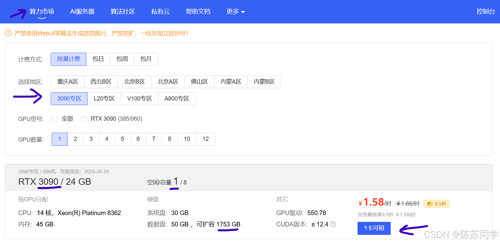
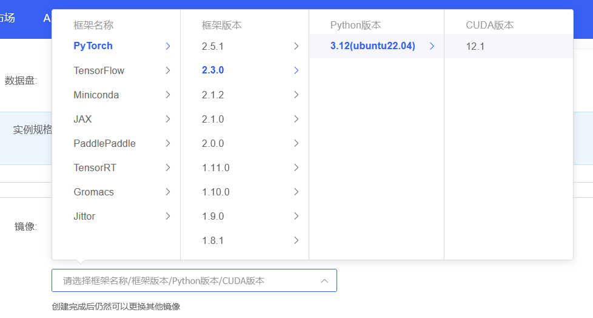
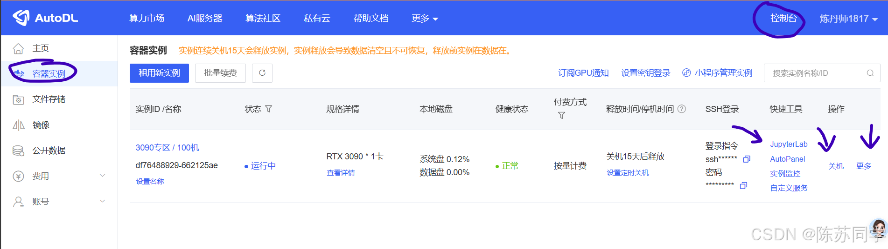
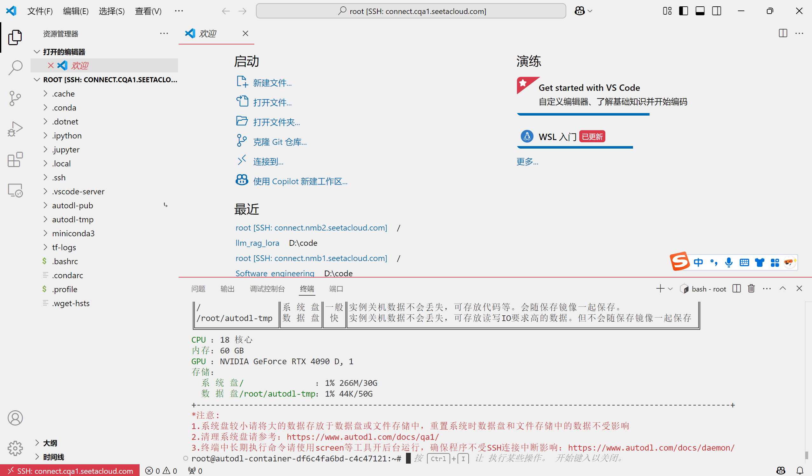
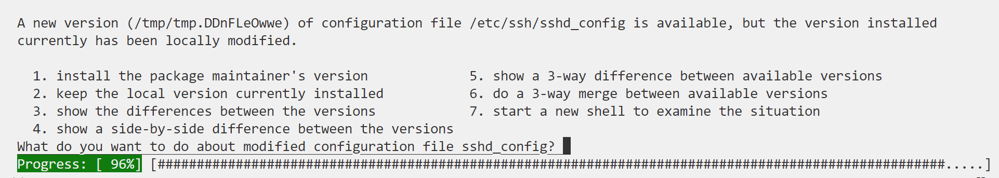
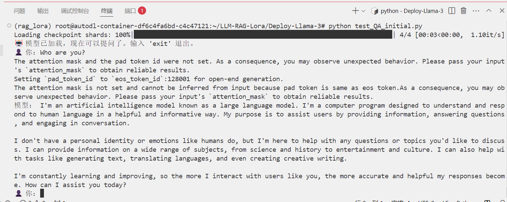
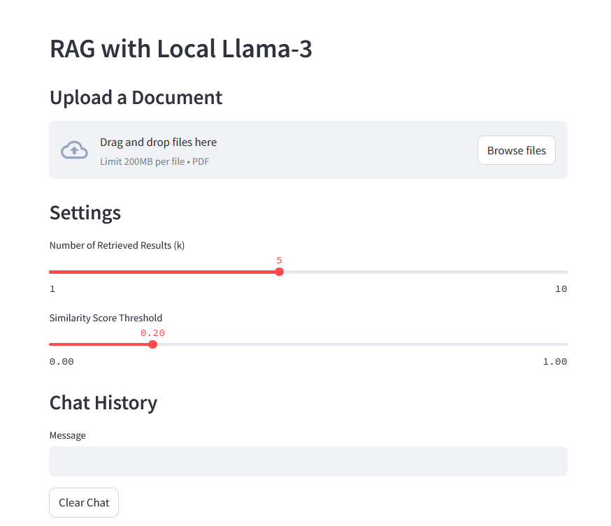
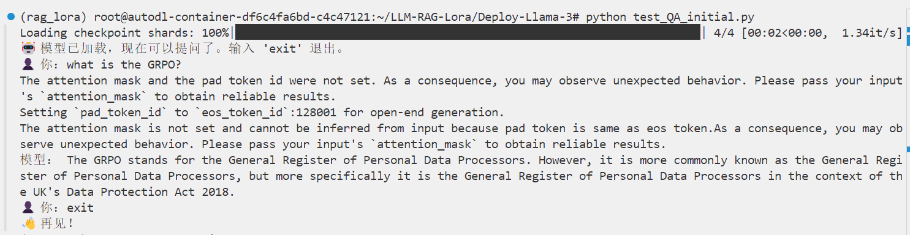
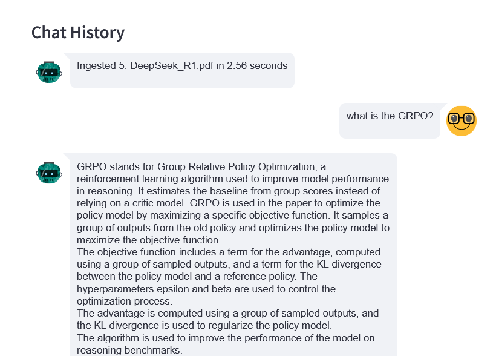

# <center>LLM+RAG+Lora实战 实验指导书</center>


## 一、在 autodl 上租服务器

### 1.在AutoDL上注册账号

官网链接：https://www.autodl.com/

AutoDL是很常用的算力云，账号注册完成后，便可进入算力市场，挑选GPU。

### 2. 在算力市场选择GPU




- 对于本实验，选择30系列或40系列**24G以上显存**的GPU即可。
- 地区可自选，哪个地区有空闲GPU就选哪个地区。

### 3. 创建实例

选择 pytorch 2.3.0、cuda 12.1 的版本，如下图。



点击创建实例。


### 4. VSCode远程连接服务器

创建成功后服务器会自动开机，如下图




参考 [该博客](https://blog.csdn.net/qq_38198286/article/details/127886049) 完成VSCode远程连接服务器操作。我们的后续工作将在vscode中展开。

连接成功的界面：




关于autodl的更多内容可参考 [该博客](https://blog.csdn.net/weixin_57972634/article/details/142632721)。

## 二、部署 Llama-3.1-8B 模型

### 1.环境配置

在终端运行：

```
sudo apt update
sudo apt upgrade -y
sudo apt autoremove -y
```
更新过程中如果遇到下图所示的界面，选择 1 即可。


```
# 升级pip
python -m pip install --upgrade pip

apt-get install -y wget curl git pciutils lshw  # 硬件检测工具

# conda 初始化
conda init bash
source ~/.bashrc

# 创建虚拟环境
conda create --name rag_lora python=3.12
# 查看已创建的虚拟环境
conda env list
# 切换到我们新创建的rag_lora环境
conda activate rag_lora
```
### 2. clone仓库

```
# clone 仓库
git clone https://github.com/Hami-8/LLM-RAG-Lora.git
```
如果clone出现了因网络问题失败的情况，尝试以下方法：

```
source /etc/network_turbo
git clone https://github.com/Hami-8/LLM-RAG-Lora.git
unset http_proxy && unset https_proxy
```

### 3. 安装依赖的包

```
cd LLM-RAG-Lora
pip install -r requirements.txt
```

### 4. 下载模型

```
cd Deploy-Llama-3
python model_download.py
```

我们提供了两种模型可供选择，分别是 Llama-3.1-8B-Instruct 和 DeepSeek-R1-Distill-Llama-8B。现在的代码默认下载Llama-3.1-8B-Instruct，如果你想要下载DeepSeek-R1-Distill-Llama-8B，解掉对应代码的注释即可。

```python
# model_download.py

import torch
from modelscope import snapshot_download, AutoModel, AutoTokenizer
import os

model_dir = snapshot_download('LLM-Research/Meta-Llama-3.1-8B-Instruct', cache_dir='/root/autodl-tmp', revision='master')
model_dir_2 = snapshot_download('mirror013/mxbai-embed-large-v1', cache_dir='/root/autodl-tmp', revision='master')

# 如果你想下载 DeepSeek-R1-Distill-Llama-8B，解掉下面代码的注释即可。
# 模型会下载到/root/autodl-tmp/deepseek-ai/DeepSeek-R1-Distill-Llama-8B 文件夹下
# model_dir_3 = snapshot_download('deepseek-ai/DeepSeek-R1-Distill-Llama-8B', cache_dir='/root/autodl-tmp', revision='master')
```

### 5. 测试

进行交互式问答测试，输入exit退出交互式问答。

```
python test_QA_initial.py
```

运行效果如图：




## 三、构建RAG

RAG项目参考 [该仓库](https://github.com/paquino11/chatpdf-rag-deepseek-r1) 进行改进。

通过streamlit打开网页进行交互，在网页上可上传PDF作为RAG的内容，所用命令如下。
```
cd ../RAG-Llama-3
streamlit run app.py
```

网页如下图：



### 不用RAG的结果

比如我们问模型一个问题 : What is the GRPO?

我们知道 GRPO的全称为Group Relative Policy Optimization，是DeepSeek-R1核心强化学习算法。

在不用RAG时，可以看到模型回答的完全不沾边。




### 用RAG的结果


我们把deepseek-r1的技术论文传到RAG中，再对它进行提问，可以看到他基本回答正确。




## 四、Lora微调


Lora项目参考 [该仓库](https://github.com/KMnO4-zx/huanhuan-chat.git) 进行改进。

### 训练

```
cd ../Lora-Llama-3
python train.py
```

训练出的Lora参数会保存在 llm_rag_lora/Lora-Llama-3/output/llama3_1_instruct_lora 中。

### 测试

三种测试文件

- test_QA_initial.py 不附加Lora的交互式问答测试。
- test_QA.py 附加Lora的交互式问答测试。
- test.py 附加Lora的非交互式测试。


```
python test_QA.py
```

### 导出

我们可以把 LoRA 权重 合并进基座模型，导出为一个新的 HuggingFace‑格式模型目录。在 Lora-Llama-3 中运行：

```
python merge_lora.py
```

即可将训练后的 LoRA 权重 合并进基座模型，导出的模型在`/root/autodl-tmp/LLM-Research/Meta-Llama-3___1-8B-Instruct_Lora`文件夹中。

## 五、Lora with RAG

进行完上一步 合并Lora权重进基座模型后，我们就可以构建 Lora with RAG 了，只需修改 `./RAG-Llama-3/rag.py`：

```
# ./RAG-Llama-3/rag.py
- llm_path: str = "/root/autodl-tmp/LLM-Research/Meta-Llama-3___1-8B-Instruct",
+ llm_path: str = "/root/autodl-tmp/LLM-Research/Meta-Llama-3___1-8B-Instruct_Lora",
```